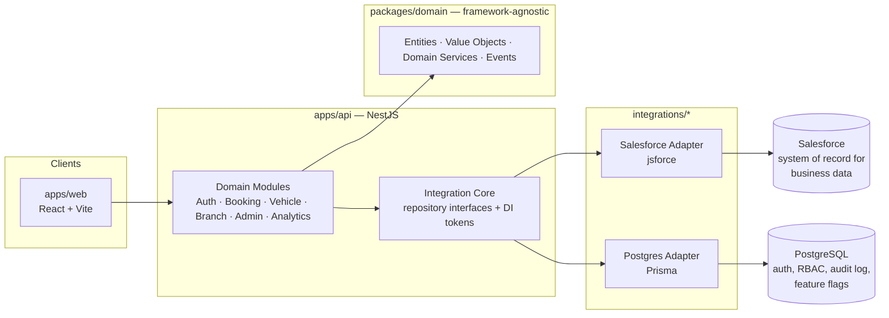

# Test Drive Management Platform (TDM)

An enterprise web platform that manages the entire vehicle test-drive lifecycle — from a customer discovering a vehicle online, to booking and completing a test drive, to a sales representative converting that drive into a CRM opportunity.

Built with Clean/Hexagonal Architecture so the business itself is never tied to a specific CRM: **Salesforce is the current data provider, not a dependency.** Every domain rule lives in framework-agnostic TypeScript and talks to the outside world only through repository interfaces — swapping Salesforce for another system (SAP, Dynamics, a plain SQL database) means writing a new adapter, not rewriting the product.

## Table of Contents

- [Why This Exists](#why-this-exists)
- [What It Does](#what-it-does)
- [Architecture](#architecture)
- [Tech Stack](#tech-stack)
- [Repository Layout](#repository-layout)
- [Getting Started](#getting-started)
- [Positioning This as a Product](#positioning-this-as-a-product)
- [Documentation](#documentation)
- [Project Status](#project-status)

## Why This Exists

Dealership test-drive scheduling is, in practice, still phone calls, walk-ins, and disconnected web forms. That leaves gaps that TDM was built to close:

- **No self-service for customers.** Booking a test drive means calling a showroom during business hours.
- **No unified calendar or conflict detection.** Vehicle and slot double-booking is caught manually, if at all.
- **No operational visibility.** Branch and regional managers have no live view of vehicle utilization, rep workload, or funnel conversion.
- **No standardized compliance trail.** License checks, consent, and drive records aren't captured consistently or queryable after the fact.
- **No structured handoff to sales.** A completed drive rarely turns into a tracked CRM opportunity without a rep remembering to create one by hand.

TDM's premise is that the test drive — not the phone call — is the highest-intent moment in a vehicle sale, and it deserves the same self-service polish as any consumer product, backed by the operational rigor an enterprise dealership group needs.

## What It Does

**Customer-facing**
- Vehicle catalog with search, body-type filters, variant comparison, EMI/financing estimates, and a multi-angle 360° viewer
- Self-service test-drive booking (showroom or home pickup) with live slot/conflict checking — no account required up front
- Passwordless onboarding: first-time bookers are registered transparently and sign back in via a magic link, OTP, or password
- "My Bookings" dashboard to track status, reschedule, or cancel, plus post-drive feedback capture

**Sales & branch operations**
- Rep-facing booking assignment and daily schedule visibility
- Branch-level booking oversight and vehicle allocation across branches
- One-click handoff from a completed drive to a Salesforce opportunity

**Admin Console (staff-only, separate auth space)**
- Staff sign in with their **real Salesforce identity** (OAuth2 + PKCE) — no separate password to manage
- Operations dashboard: booking trends, vehicle utilization, cancellation/conversion rates, rep performance
- Test-drive management with status filtering and rep (re)assignment
- Users & Permissions: role-based access control (Admin / Manager) with granular permission grants and full audit logging

## Architecture



- **Domain layer (`packages/domain`)** — Customer, Vehicle, Branch, SalesRepresentative, Booking, and SalesOpportunity as aggregates, with immutable value objects (`Email`, `Money`, `TimeSlot`) and domain services (`BookingConflictChecker`, `CancellationPolicy`, `WaitlistPromotionService`). Zero knowledge of Salesforce, Postgres, or HTTP.
- **API layer (`apps/api`)** — NestJS modules per business capability, each depending only on repository *interfaces* (`BOOKING_REPOSITORY`, `VEHICLE_REPOSITORY`, etc.), never on a concrete adapter. A single `InfrastructureModule` wires those tokens to real implementations.
- **Adapters (`integrations/*`)** — `integrations/salesforce` implements the repositories for core business data (bookings, vehicles, branches, customers, analytics) over SOQL. `integrations/postgres` implements a parallel set for auth, staff RBAC, audit logging, and feature flags via Prisma. Both are wired behind the same interfaces, which is the concrete proof the adapter seam works — the platform already runs on two different backends side by side.
- **Client (`apps/web`)** — a single React app with two independent route trees: a public customer experience and a Salesforce-identity-gated Admin Console, each with its own auth guard.

## Tech Stack

| Layer | Technology |
|---|---|
| Frontend | React 18, TypeScript, Vite, Tailwind CSS, React Router, TanStack Query, React Hook Form + Zod, Recharts |
| Backend API | NestJS 10 (Express), class-validator/class-transformer, Swagger/OpenAPI |
| Domain layer | Plain TypeScript, framework-agnostic (`@tdm/domain`) |
| Business data | Salesforce (`Contact`, `Vehicle__c`, `Branch__c`, `Booking__c`, `Sales_Rep__c`, `Drive_Feedback__c`, …) via `jsforce` |
| Auth / staff identity | PostgreSQL via Prisma (`@tdm/postgres-adapter`) |
| Sales dashboard | Salesforce Lightning Web Components + Apex |
| Monorepo tooling | npm workspaces, TypeScript project references |

## Repository Layout

```
apps/api          NestJS backend — REST API, domain modules, DI wiring
apps/web          React frontend — customer site + Admin Console
packages/domain   Framework-agnostic entities, value objects, domain errors
packages/types    Shared DTOs between frontend and backend
packages/utils    Shared utilities
integrations/salesforce   Salesforce adapter (jsforce) + org metadata
integrations/postgres     Prisma schema/client for auth + staff identity
infrastructure/           Local Postgres container (docker-compose)
docs/                     Product, domain, and architecture documentation
```

## Getting Started

**Prerequisites:** Node.js 20+, npm, Docker (or a local PostgreSQL 16), the Salesforce CLI (`sf`) authenticated against a Salesforce org, and a Salesforce Connected App configured for staff "Login with Salesforce."

```bash
# 1. Install dependencies
npm install

# 2. Start the auth/staff database
docker compose -f infrastructure/docker-compose.yml up -d

# 3. Authenticate the Salesforce CLI and deploy TDM metadata
sf org login web --alias tdm-dev
sf project deploy start --source-dir integrations/salesforce/mdapi --target-org tdm-dev

# 4. Run Postgres migrations
npm run prisma:migrate --workspace=integrations/postgres

# 5. Seed sample data
node integrations/salesforce/seed-catalog.mjs
node integrations/postgres/seed-first-admin.mjs <your-email> "Your Name"

# 6. Run the app (two terminals)
npm run dev:api   # http://localhost:3000/api/v1  (Swagger at /api/docs)
npm run dev:web   # http://localhost:5173
```

Each service reads its own untracked `.env` file — see [`docs/07-overview-and-setup-guide.md`](docs/07-overview-and-setup-guide.md) for the full variable list and hosting checklist.

Other root scripts: `npm run build`, `npm run lint`, `npm run typecheck` (all run across every workspace).

## Positioning This as a Product

TDM was designed from the outset to be more than a single dealership's internal tool:

- **CRM-agnostic by construction.** The hexagonal architecture means the product isn't "the Salesforce test-drive app" — Salesforce is one interchangeable data provider among several, proven by the fact that Postgres already backs a second, independent slice of the same domain (auth and staff identity). A dealership group on a different CRM is a new adapter, not a rewrite.
- **Multi-branch, multi-role from day one.** Branches, cross-branch vehicle allocation, per-branch booking oversight, and regional roll-up analytics are first-class domain concepts, not bolted on — the data model already fits a dealership *group*, not a single showroom.
- **Enterprise access control and auditability.** Role-based permissions (Admin/Manager), staff authentication via real corporate identity (Salesforce OAuth2 + PKCE, no platform-managed passwords for staff), and structured audit logging are built in — the compliance posture a dealership network or OEM would require before rollout.
- **A genuine customer-facing product surface, not just an admin tool.** The public booking flow, catalog, comparison, and 360° viewer are built to the same UX bar as a direct-to-consumer product, because for the customer, it *is* one.
- **Clear packaging seams.** The customer site, Admin Console, and Salesforce Lightning dashboard are already separable surfaces — a natural fit for tiered SaaS packaging (self-service booking as the entry tier, the Admin Console and analytics as an upsell).

The path from "working platform" to "sellable product" is a hosting and hardening exercise, not an architecture change — see [Project Status](#project-status) for exactly what's left.

## Documentation

Detailed product and engineering documentation lives in [`docs/`](docs/):

| Doc | Covers |
|---|---|
| [01-product-vision-and-requirements.md](docs/01-product-vision-and-requirements.md) | Problem statement, vision, goals, success metrics |
| [02-business-capability-map.md](docs/02-business-capability-map.md) | Full business capability catalog |
| [03-personas-and-journeys.md](docs/03-personas-and-journeys.md) | User personas and end-to-end journeys |
| [04-salesforce-schema-design.md](docs/04-salesforce-schema-design.md) | Salesforce object/field design |
| [05-domain-model.md](docs/05-domain-model.md) | Domain entities, value objects, services, events |
| [06-system-architecture.md](docs/06-system-architecture.md) | Layered architecture and adapter boundaries |
| [07-overview-and-setup-guide.md](docs/07-overview-and-setup-guide.md) | Full local setup, environment variables, hosting checklist |
| [08-salesforce-automation-audit.md](docs/08-salesforce-automation-audit.md) | What runs in Salesforce vs. the Node backend, and why |

## Project Status

The platform runs end-to-end today: booking, customer auth, the Admin Console, RBAC, and the Salesforce/Postgres adapters are all implemented and working. Known items before an unattended production deployment (tracked in the codebase, not hidden gaps):

- **Salesforce auth for the API** currently shells out to an interactive `sf` CLI session; production hosting needs a Connected App using the JWT Bearer flow with a dedicated integration user (see `integrations/salesforce/src/connection.ts`).
- **Core business data (vehicles, bookings, customers) has one live adapter** (Salesforce). The Postgres adapter already proves the seam for auth/RBAC/audit; a second adapter for core domain data would be additive, not a refactor.
- Standard production hardening — managed Postgres, secrets management, HTTPS termination, and CORS locked to the deployed origin — is documented in the [setup guide](docs/07-overview-and-setup-guide.md#prerequisites-for-hosting-on-a-server).
