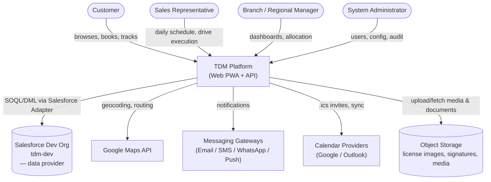
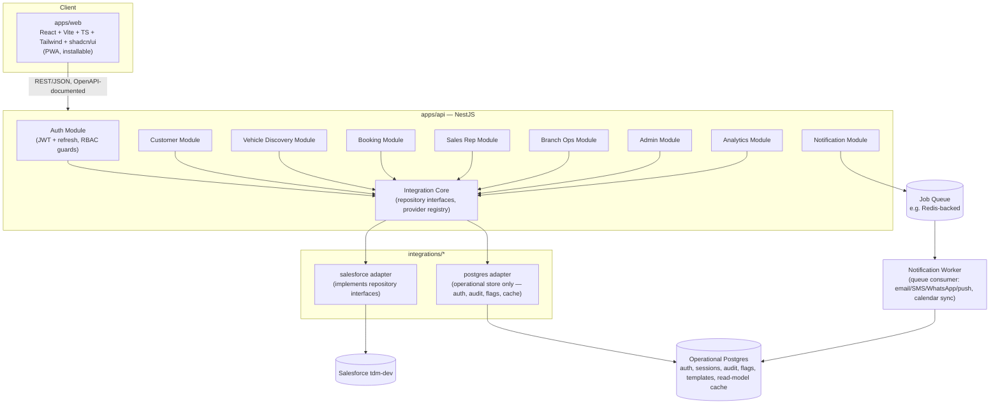

# System Architecture: Context, Containers, Components, Data, API

**Phases 6–9** · Status: Draft for approval

## Phase 6 — System Context Diagram



**Read this as:** the platform is the only thing any human actor touches directly. Salesforce, Maps, messaging gateways, calendar providers, and object storage are all outbound integrations the platform owns — never surfaced to the frontend as concepts (per the Phase 1 mandate that the frontend must never know Salesforce exists).

## Phase 7 — Container & Component Diagram



**Key architectural point:** every domain module (Customer, Vehicle, Booking, etc.) depends only on `IntegrationCore`'s repository interfaces — never directly on `SFAdapter`. Swapping Salesforce later means writing a new adapter package and rewiring dependency injection in one place (a Nest module), not touching any of the eight domain modules.

## Phase 8 — Database & Domain Design

### Decision: two data stores, not one

Salesforce is the **system of record for business/domain data** (customers, vehicles, bookings, compliance, feedback, allocations, sales pipeline — everything in the [domain model](05-domain-model.md)). But the platform still needs its **own operational store** for concerns that are not Salesforce's job and would be awkward/expensive to force into it (API call limits, schema rigidity for high-write low-value data). This operational store is **PostgreSQL**, owned by the `postgres` integration adapter, and is invisible to the domain layer exactly like Salesforce is — it's accessed only through the same kind of repository interfaces (e.g., `AuditLogRepository`, `FeatureFlagRepository`), just implemented against Postgres instead of Salesforce because that's the right tool for this data shape.

| Concern | Store | Why not Salesforce |
|---|---|---|
| Platform auth credentials (password hash, MFA secret) | Postgres | Salesforce is a data provider, not an identity provider for portal customers; keeps credential handling inside our own security boundary |
| Refresh tokens / sessions | Postgres | High write volume, short-lived, no business value in CRM |
| Audit log entries | Postgres (append-only table) | Needs to log *every* write across every module including infra-level events, independent of which business-data provider is active |
| Feature flags | Postgres | Config, not business data |
| Notification templates & delivery log | Postgres | High volume, operational |
| Analytics/dashboard read models | Postgres (materialized/cached projections, rebuilt from domain events + Salesforce reads) | Avoids hitting Salesforce API limits on every dashboard render; acceptable eventual consistency for manager dashboards |
| Idempotency keys (webhook/retry safety) | Postgres | Infra concern |

### Operational Postgres — core tables (illustrative, refined in Phase 15/16)
`auth_users`, `auth_credentials`, `refresh_tokens`, `audit_log_entries`, `feature_flags`, `notification_templates`, `notification_deliveries`, `analytics_read_models`, `idempotency_keys`.

`auth_users.customer_id` / `auth_users.sales_rep_id` are the join keys back to the Salesforce `Contact.Portal_User_Id__c` / `Sales_Rep__c` records — this is the one place the two stores are explicitly linked, and it lives in the adapter layer's mapping code, not in domain logic.

### Salesforce store
Already deployed — see [docs/04-salesforce-schema-design.md](04-salesforce-schema-design.md).

## Phase 9 — API Contracts (v1, REST, OpenAPI-documented)

Base path: `/api/v1`. All endpoints (except `/auth/*`) require a Bearer JWT; role requirements noted per endpoint. Full OpenAPI YAML will be generated from NestJS decorators during Phase 16 build — this table is the contract those decorators must satisfy.

| Method | Path | Purpose | Roles |
|---|---|---|---|
| POST | `/auth/register` | Register customer (email+phone required; triggers OTP) | Public |
| POST | `/auth/verify-otp` | Verify OTP to activate account | Public |
| POST | `/auth/login` | Password or social login | Public |
| POST | `/auth/refresh` | Rotate access token | Authenticated (refresh token) |
| POST | `/auth/forgot-password` / `/auth/reset-password` | Password recovery | Public |
| GET | `/customers/me` | Profile + dashboard summary | Customer |
| PATCH | `/customers/me` | Update profile | Customer |
| GET | `/customers/me/bookings` | Booking history | Customer |
| GET/POST/DELETE | `/customers/me/wishlist` | Wishlist management | Customer |
| GET | `/vehicles` | Search/filter catalog (query params: bodyType, fuelType, priceRange, branchId, q) | Public |
| GET | `/vehicles/:id` | Vehicle detail (specs, media, EMI) | Public |
| POST | `/vehicles/compare` | Compare up to 4 vehicle IDs | Public |
| GET | `/vehicles/:id/availability` | Slot availability by branch/date | Public |
| POST | `/bookings` | Create a booking (requires authenticated, registered customer) | Customer |
| GET | `/bookings/:id` | Booking detail incl. live status | Customer, Sales Rep (assigned), Branch Manager |
| POST | `/bookings/:id/reschedule` | Reschedule within policy window | Customer |
| POST | `/bookings/:id/cancel` | Cancel within policy window | Customer |
| POST | `/bookings/:id/check-in` | QR/manual check-in | Sales Rep |
| POST | `/bookings/:id/start` / `/bookings/:id/end` | Drive execution | Sales Rep |
| POST | `/bookings/:id/compliance` | Submit OTP/license/consent/signature | Customer, Sales Rep |
| POST | `/bookings/:id/feedback` | Submit structured feedback | Customer, Sales Rep |
| POST | `/bookings/:id/opportunity` | Create sales opportunity from a completed booking | Sales Rep |
| GET | `/reps/me/schedule` | Rep's daily schedule + route | Sales Rep |
| GET | `/branches/:id/dashboard` | Inventory, staffing, booking load | Branch Manager |
| POST | `/branches/:id/vehicles/:vehicleId/allocate` | Request vehicle transfer | Branch Manager |
| GET | `/analytics/funnel` \| `/analytics/utilization` \| `/analytics/team-performance` | Manager dashboards | Branch/Regional Manager |
| GET/POST/PATCH | `/admin/users`, `/admin/roles`, `/admin/branches`, `/admin/feature-flags`, `/admin/notification-templates` | Administration | Admin |
| GET | `/admin/audit-log` | Audit trail query | Admin |

### Example contract — the vertical slice we'll build first

**POST `/bookings`**
```json
// Request
{
  "vehicleId": "veh_01H...",
  "branchId": "br_01H...",
  "driveType": "Dealership",
  "slot": { "start": "2026-07-25T10:00:00Z", "end": "2026-07-25T10:30:00Z" }
}
// Response 201
{
  "id": "bk_01H...",
  "status": "Requested",
  "vehicleId": "veh_01H...",
  "slot": { "start": "2026-07-25T10:00:00Z", "end": "2026-07-25T10:30:00Z" },
  "conflictChecked": true
}
// Response 409 (conflict)
{ "error": "SLOT_CONFLICT", "message": "This vehicle is already booked for an overlapping time.", "suggestedSlots": ["2026-07-25T10:30:00Z", "2026-07-25T11:00:00Z"] }
```

This maps directly onto `BookingRepository.create()` + `BookingConflictChecker` from the [domain model](05-domain-model.md), which the Salesforce Adapter fulfills by writing a `Booking__c` record after checking for overlapping `Booking__c` rows for the same `Vehicle__c`.

---

## Risks & recommendations before Phase 10 (Frontend Architecture)

1. **Operational Postgres is a new piece of infrastructure** not explicit in your original ask — flagging it now because auth/session/audit/flags genuinely don't belong in Salesforce, but it does mean "backend-agnostic" means *the business-data provider* is swappable, not that the platform is a zero-infrastructure app. Recommend confirming this is acceptable before Phase 15 (Monorepo Setup) provisions it.
2. **Analytics read-model caching** (Postgres materialized views refreshed from Salesforce + domain events) is the recommended approach to avoid Salesforce API rate limits on manager dashboards — flagging as a deliberate eventual-consistency trade-off, not a bug.
3. Ready to proceed to Phase 10–13 (Frontend Architecture, Backend Architecture, Salesforce Integration Layer detail, UI/UX Design System) — or, given we already have a real org and schema, I could jump straight to scaffolding the monorepo (Phase 15) and building the vertical slice (auth → vehicle discovery → booking) end-to-end against the live schema. Your call on which you'd rather see next.
